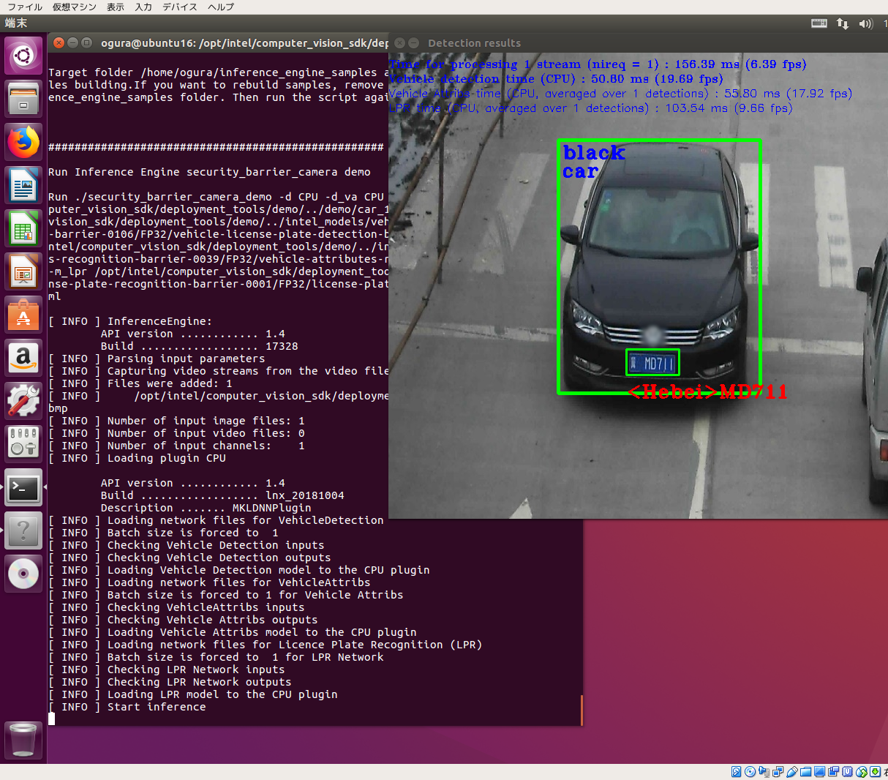

# OpenVINO for Movidius NCS-1 and NCS-2(2nd generation stick)


[github for NCS(1st generation)](https://github.com/movidius/ncsdk) is completed. And NCS-2(2nd generation) is supported by OpenVINO. OpenVINO support not only NCS 1 and 2 but also CPU, GPU and FPGA(Altera Arria10 GX).  

[OpenVINO do not support RaspnerryPi](https://ncsforum.movidius.com/discussion/1302/intel-neural-compute-stick-2-information#latest)  

This is story of estimation of combination btn movidius NCS and OpenVINO.  

## Download and installation

After registration we can get OpenVINO from [here](https://software.intel.com/en-us/openvino-toolkit).  

According to [here(Install the Intel® Distribution of OpenVINO™ toolkit for Linux)](https://software.intel.com/en-us/articles/OpenVINO-Install-Linux), we can do from install to check by running DEMO(inference car.png) on CPU processing(We employed caffe optimizer installation only).  

**After Download l_openvino_toolkit_p_<version>.tgz,**
```
$ tar xzf l_openvino_toolkit_p_<version>.tgz
$ cd l_openvino_toolkit_p_<version>
# ./install_cv_sdk_dependencies.sh
# ./install_GUI.sh
$ . /opt/intel/computer_vision_sdk/bin/setupvars.sh ## add your .bashrc
```
**Setup Caffe and Tensorflow Model Optimizer**  
```
$ cd /opt/intel/l_openvino_toolkit_p_<version>/deployment_tools/model_optimizer/install_prerequistes
$ ./install_prerequisites_caffe.sh
$ ./install_prerequisites_tf.sh
```
If you need more Framework, run bellow,  
```
install_prerequisites_<FW>.sh, FW is such as mxnet, onnx, kaldi.  
```

**1st DEMO on CPU result is bellow,**  

**Notice!:** Demo sample script create directory ~/openvino and download .prototxt and .caffemodel in it. So notice permission of directory.  

```
$ cd ~/intel/computer_vision_sdk/deployment_tools/model_optimizer/install_prerequisites/
# ./install_prerequisites.sh
$ cd ~/intel/computer_vision_sdk/deployment_tools/demo
$ ./demo_squeezenet_download_convert_run.sh
```


In my first impression, download and installation of OpenVINO is very easy!, great.  

**2nd DEMO on CPU result is bellow,**

1pipe : recognize car region box  
2pipe : recognize licence plate region box  
3pipe : recognize charactors on licence plate  

```
$ cd ~/intel/computer_vision_sdk/deployment_tools/demo
$ ./demo_security_barrier_camera.sh
```



Our DEMO-environment is on VirtualBox Ubuntu16.04 on Intel Celeron CPU.  
But it shows performance as 6.39fps for 1st pipe, 19.69fps for 2nd pipe, 9.55fps for 3rd pipe.  

## DEMOs using Movidius NCS-1
**2 DEMOs on MYRIAD**  
(demo_squeezenet_download_convert_run.sh, demo_security_barrier_camera.sh)

To run demo scripts on NCS-1, **add usbboot rule** and **add your user id into "users group"**, finally run demo scripts with **-d MYRIAD option**.

Setup udev rules for MYRIAD.  
Place [97-myriad-usbboot.rules](./etc/udev/rules.d/97-myriad-usbboot.rules) on /etc/udev/rules.d/

```
# usermod -a -G users "$(whoami)"
# cp 97-usbboot.rules /etc/udev/rules.d/
# udevadm control --reload-rules
# udevadm trigger
# ldconfig
```

On the our way to install, we selected option for Movidius NCS-1 and NCS-2 support, so that we are ready to run NCS via OpenVINO as inference engin(called IE) **by adding -d MYRIAD** with sample script.  

```
$ cd ~/intel/computer_vision_sdk/deployment_tools/demo
$ ./demo_squeezenet_download_convert_run.sh -d MYRIAD
  or
$ ./demo_security_barrier_camera.sh -d MYRIAD
```
Check "[INFO] Loading LPR model to **the MYRIAD plugin**" log messages.  

## Model Optimizer
To import caffe or tensorflow trained model into OpenVINO, use convertion scripts such as mo_caffe.py or mo_tf.py on /opt/intel/computer_vision_sdk/deployment_tools/model_optimizer/.  

```
$ python3 /opt/intel/computer_vision_sdk/deployment_tools/model_optimizer/mo_tf.py --input_model ~/tf-openpose/models/graph/mobilenet_thin/graph_freeze.pb --input_shape=[1,368,432,3] --data_type=FP16
Model Optimizer arguments:
Common parameters:
    - Path to the Input Model:  /home/ogura/tf-openpose/models/graph/mobilenet_thin/graph_freeze.pb
    - Path for generated IR:    /home/ogura/tf-openpose/mo_tf/.
    - IR output name:   graph_freeze
    - Log level:    ERROR
    - Batch:    Not specified, inherited from the model
    - Input layers:     Not specified, inherited from the model
    - Output layers:    Not specified, inherited from the model
    - Input shapes:     [1,368,432,3]
    - Mean values:  Not specified
    - Scale values:     Not specified
    - Scale factor:     Not specified
    - Precision of IR:  FP16
    - Enable fusing:    True
    - Enable grouped convolutions fusing:   True
    - Move mean values to preprocess section:   False
    - Reverse input channels:   False
TensorFlow specific parameters:
    - Input model in text protobuf format:  False
    - Offload unsupported operations:   False
    - Path to model dump for TensorBoard:   None
    - List of shared libraries with TensorFlow custom layers implementation:    None
    - Update the configuration file with input/output node names:   None
    - Use configuration file used to generate the model with Object Detection API:  None
    - Operations to offload:    None
    - Patterns to offload:  None
    - Use the config file:  None
Model Optimizer version:    1.4.292.6ef7232d

[ SUCCESS ] Generated IR model.
[ SUCCESS ] XML file: /home/ogura/tf-openpose/mo_tf/./graph_freeze.xml
[ SUCCESS ] BIN file: /home/ogura/tf-openpose/mo_tf/./graph_freeze.bin
[ SUCCESS ] Total execution time: 8.57 seconds. 


$ ls
graph_freeze.bin  graph_freeze.mapping  graph_freeze.xml
```

## Also refer below web site,  
[Intel Neural Compute Stick Getting start](https://software.intel.com/en-us/neural-compute-stick/get-started)  
[AIを始めよう！PythonでOpenVINOの仕組みを理解する](https://qiita.com/ammo0613/items/ff7452f2c7fab36b2efc)  
