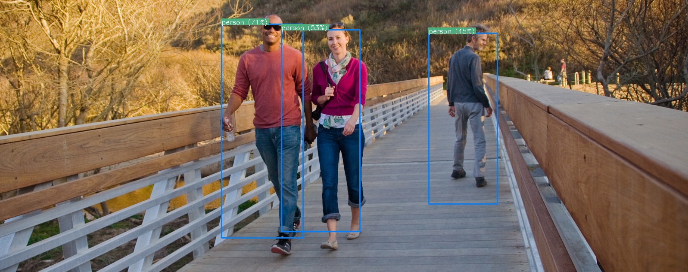

# OpenVINO on RaspberryPI stretch

Download OpenVINO according to [OpenVINO R5 supports RaspberryPI stretch](https://software.intel.com/en-us/articles/OpenVINO-Install-RaspberryPI).

## ARM Single Board Computer

RaspberryPi Model B+  
7inch LCD  
MIPI Camera  

## First move for RaspberryPi
**Before booting,**  

- Install RaspberryPi OS **stretch** image into SDCard.  
  In jessie, install failed, use stretch raspbian OS.  

- Change LCD upside down  
  To modify upside down of LCD, add line  
  **'lcd_rotate=2'**  
  in file **boot/config.txt**, and reboot!  

- For ssh connection  
  On Windows with USB adapter, insert SDCard of Raspi stretch image.  
  **touch boot/ssh**  
  boot/ssh file contains nothing or free words.  

**After booting,**  

- Change keyboard layout to Japanese

```
# raspi-config  
```
> International Options  
>> Change Keyboard Layout  
>>> Generic 105-key(Intel) PC  
>>>> Other  
>>>>>  Japanese  
>>>>>> Japanese - (OADG 109A)  
>>>>>>> The default for the keyboard layout  
>>>>>>>> No compose key  
>>>>>>>>> Finish  

too deep!  

```
# apt update
# apt install -y uim uim-anthy  
# reboot  
```

- Expand filesystem

```
# raspi-config --expand-rootfs
# reboot
```

- Upgrade  

```
# apt update && apt upgrade && reboot
```

- sshd  

Generate ssh keys if needs on such as jessi,,  
```
# cd /etc/ssh
# ssh-keygen -f /etc/ssh/ssh_host_rsa_key -N '' -t rsa
# ssh-keygen -f /etc/ssh/ssh_host_dsa_key -N '' -t dsa
# ssh-keygen -f /etc/ssh/ssh_host_ecdsa_key -N '' -t ecdsa
# ssh-keygen -f /etc/ssh/ssh_host_ed25519_key -N '' -t ed25519
```

```
# systemctl enable ssh
# systemctl restart ssh
# reboot
```

- Install VBoxLinuxAdditions if you are on VirtualBox

mount cdrom from Pulldown Menu and bellow,
```
# sh /media/cdrom/VBoxLinuxAdditions.run
# reboot
```

- Resize Display if need,

```
# xrandr
   800x600       60.00*+  60.32  
   2560x1600     59.99  
   1920x1440     60.00  
   1856x1392     60.00  
   1792x1344     60.00  
   1920x1200     59.88  
   1600x1200     60.00  
   1680x1050     59.95  
   1400x1050     59.98  
   1280x1024     60.02  
   1440x900      59.89  
   1280x960      60.00  
   1360x768      60.02  
   1280x800      59.81  
   1152x864      75.00  
   1280x768      59.87  
   1024x768      60.00  
   640x480       59.94  

# xrandr -s 1024x768
```

## Install OpenVINO R5
[Download l_openvino_toolkit_ie_p_2018.5.445.tgz](https://download.01.org/openvinotoolkit/2018_R5/packages/l_openvino_toolkit_ie_p_2018.5.445.tgz) or latest version from here  

```
$ wget https://download.01.org/openvinotoolkit/2018_R5/packages/l_openvino_toolkit_ie_p_2018.5.445.tgz
$ tar xzf l_openvino_toolkit_ie_p_2018.5.445.tgz
$ sed -i "s|<INSTALLDIR>|$(pwd)/inference_engine_vpu_arm|"  inference_engine_vpu_arm/bin/setupvars.sh
$
```

- setup variables

```
$ . inference_engine_vpu_arm/bin/setupvars.sh
[setupvars.sh] OpenVINO environment initialized
$ sudo usermod -a -G users "$(whoami)"
$
```
Let you think return value of "$(whoami)" is ether pi or root!

- setup USB rule

```
$ sh inference_engine_vpu_arm/install_dependencies/install_NCS_udev_rules.sh
Update udev rules so that the toolkit can communicate with your neural compute stick
[install_NCS_udev_rules.sh] udev rules installed
$
```
Flush!! but don't warry,,  

- build sample

```
# apt install -y cmake
$ cd inference_engine_vpu_arm/deployment_tools/inference_engine/samples
$ mkdir build && cd build
$ cmake .. -DCMAKE_BUILD_TYPE=Release -DCMAKE_CXX_FLAGS="-march=armv7-a"
$ make -j2 object_detection_sample_ssd
-- /etc/*-release distrib: Raspbian 9
-- OMP Release lib: OMP_LIBRARIES_RELEASE-NOTFOUND
-- OMP Debug lib: OMP_LIBRARIES_DEBUG-NOTFOUND

...
...

make[3]: Warning: File '../object_detection_sample_ssd/main.cpp' has modification time 5627085 s in the future
[ 96%] Building CXX object object_detection_sample_ssd/CMakeFiles/object_detection_sample_ssd.dir/main.cpp.o
[100%] Linking CXX executable ../armv7l/Release/object_detection_sample_ssd
make[3]: warning:  Clock skew detected.  Your build may be incomplete.
[100%] Built target object_detection_sample_ssd
$
```

- Download pre-trained models of samples,

Face Detection sample,

```
$ wget --no-check-certificate https://download.01.org/openvinotoolkit/2018_R4/open_model_zoo/face-detection-adas-0001/FP16/face-detection-adas-0001.bin
$ wget --no-check-certificate https://download.01.org/openvinotoolkit/2018_R4/open_model_zoo/face-detection-adas-0001/FP16/face-detection-adas-0001.xml

$ ls *bin *xml
  face-detection-adas-0001.bin  face-detection-adas-0001.xml
```
Run sample with NCS(Myriad-2),
```
# apt install -y eog
$ ./armv7l/Release/object_detection_sample_ssd -m face-detection-adas-0001.xml -d MYRIAD -i <path_to_image>
[ INFO ] InferenceEngine: 
        API version ............ 1.4
        Build .................. 19154
Parsing input parameters
[ INFO ] Files were added: 1
[ INFO ]     /home/pi/Downloads/p2.jpg
[ INFO ] Loading plugin

        API version ............ 1.5
        Build .................. 19154
        Description ....... myriadPlugin
[ INFO ] Loading network files:
        face-detection-adas-0001.xml
        face-detection-adas-0001.bin
[ INFO ] Preparing input blobs
[ INFO ] Batch size is 1
[ INFO ] Preparing output blobs
[ INFO ] Loading model to the plugin
[ WARNING ] Image is resized from (500, 422) to (672, 384)
[ INFO ] Batch size is 1
[ INFO ] Start inference (1 iterations)
[ INFO ] Processing output blobs
[0,1] element, prob = 1    (112.61,49.3243)-(153.564,103.13) batch id : 0 WILL BE PRINTED!
[1,1] element, prob = 1    (328.613,51.9773)-(373.535,112.918) batch id : 0 WILL BE PRINTED!

...
...

[ INFO ] Image out_0.bmp created!
total inference time: 161.869
Average running time of one iteration: 161.869 ms
Throughput: 6.17785 FPS
[ INFO ] Execution successful

$ eog out_0.bmp
```

  
Oowh~

SSD_Mobilenet sample,
```
$ cd vinosyp/ie/SSD_Mobilenet
$ python3 demo_ssd_mobilenet.py images/pedestiran-bridge.jpg
n/c/h/w (from xml)= 1 3 300 300
input_blob : out_blob = data : detection_out
input image = images/pedestiran-bridge.jpg
in-frame (1, 3, 300, 300)
fin (1, 1, 100, 7)
top
[  0.          15.           0.71582031   0.32128906   0.08862305
   0.43945312   0.87402344]
draw 15.0 71 person (71%)
[  0.          15.           0.5390625    0.40869141   0.11035156
   0.52197266   0.8515625 ]
draw 15.0 53 person (53%)
[  0.          15.           0.45532227   0.62207031   0.12280273
   0.72167969   0.75      ]
draw 15.0 45 person (45%)
```



Huuhmul

## Using CSI Camera element14 with RaspberryPi and OpenVINO

- Setup CSI Camera hardware  
  Refer to [Setup MIPI-CSI Camera on RaspberryPI-3](https://github.com/k5iogura/ncsdk_v2/blob/master/RaspberryPi_CSI.md)  

- Run SSD_Mobilenet with CSI Camera, RaspberryPi and OpenVINO

```
$ cd vinosyp/ie/SSD_Mobilenet
$ python3 demo_csi_ssd_mobilenet.py
   Playback 11.86FPS (Prediction 11.85 FPS)
```
Wooh, **so fast**! 11FPS for prediction.  
- How to measure FPS  
  Prediction FPS = (done frames) / ((drawing time) + (waiting time of IE inference engine))
  
- Reason why fast speed is bellow,  
  CSI Camera Framerate is specified as 120 (it's over limittation?).  
  Inference requests for NCS is 3.  
  
## How to start immediately after starting X-Window session

- Shell script to start python3 demo  

Look at vinosyp/ie/SSD_Mobilenet/autostart_demo_ssd.sh

```
$ cat ~/autostart_demo_ssd.sh
source /home/pi/Downloads/inference_engine_vpu_arm/bin/setupvars.sh
for i in `seq 1000`;do sleep 5;sudo sh -c "echo 0 > /sys/class/graphics/fb0/blank";done&
sudo sh -c "echo 0 > /sys/class/graphics/fb0/blank"
export DISPLAY=:0
xhost +
cd /home/pi/vinosyp/ie/SSD_Mobilenet
xterm -geometry +10+10 -e "python3 demo_csi_ssd_mobilenet.py -r 3 -crw 640 -crh 400 -demo"
```

- lxsession file

```
cat ~/.config/lxsession/LXDE-pi/autostart
@lxpanel --profile LXDE-pi
@pcmanfm --desktop --profile LXDE-pi
@xscreensaver -no-splash
@point-rpi
@/home/pi/autostart_demo_ssd.sh
```
Last line denotes starting demo.  

***Last update March.13,2019***  
