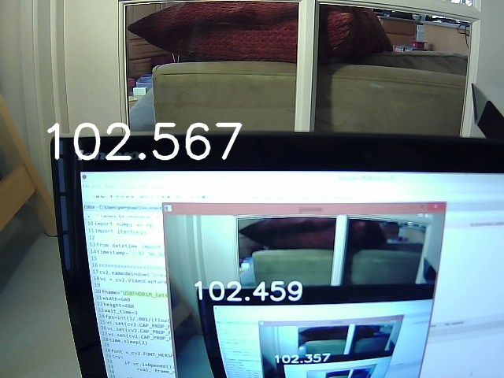

# Webcam-Latency-Measurement
Script for measuring latency of USB webcams

This is a short python script that can be used to measure the latency and frame rate for a USB camera. It works
by displaying a time on the screen, and then displaying the image from a USB camera that is pointed at the screen. 
The difference between the time shown on the screen and from the image in the USB camera is the latency.  The 
FPS (frames per second) is printed in the console.  

The image will look something like this:

In this case the latency is 102.567s - 102.459s = 0.108s

To take a snapshot of the image and save it as a .jpg, press the spacebar.  ESC exits and quits program. You'll want to take a few snapshots to get an averaged value.  The latency can jump around quite a bit. 

You may need to edit the number for the videocam to get the right one on your system.  

It requires the OpenCV2 package. 

[More info on usage and some results](https://www.makehardware.com/2016/03/29/finding-a-low-latency-webcam/)

# To increase FPS by Threading UVC Camera capture

UVC Camera capture contains 2 phase.  
First phase is waiting for the end of image senser.  
Second phase is processing of mozic to rgb data via isp.  
So, both phasees are't load of cpu and only waiting for UVC Camera capture.  
By moving capture proccess into sub thread, FPS increase.  

- cam_threading.py  
  main and capture 2threads to view video stream.  
- vid.py  
  Has -th option to switch multi thread or single thread.  
