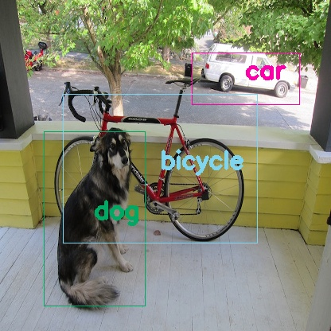
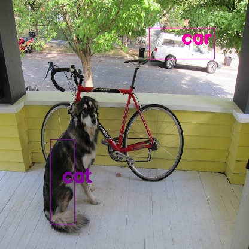

# Inference with tflite by numpy only python  

### Requirements  
tensorflow  v1.11 or later to convert pb to tflite format  
image viewer such as feh, eog, imagemagick   
flatbuffers to parse tflite format   

### How to test
- **Create y.pb(include YOLOv2-Tiny network and weights)**  
- **Convert to frozen.pb**  
- **Prepare tflite flatbuffers python modules**  
- **Run inference with y*.tflite.** y.tflite for floating and yq.tflite for quantized int32  

schema_v3+MUL+MAXIMUM.fbs is extended for **MUL** and **MAXIMUM** as Builtin-Operator.  
MUL is No.18, MAXIMUM is No.55 used in tensorflow-lite and net.y uses these Builtin-Operator to represent **leaky-relu**.  

## Floating inference mode  

```
 $ wget https://pjreddie.com/media/files/yolov2-tiny-voc.weights
 $ ls yolov2-tiny-voc.weights
   yolov2-tiny-voc.weitghts
   
 $ python test_pb.py
 $ ls y.pb
   y.pb
   
 $ tflite_convert --output_file=y.tflite --graph_def_file=y.pb --inference_type=FLOAT
                  --inference_input_type=FLOAT --input_arrays=input/Placeholder --output_arrays=xoutput
 $ ls y.tflite
   y.tflite
 
 $ ./make_tflite.sh
 $ ls -d tflite
   tflite/
   
 $ python fbapim.py -v -t y.tflite
 
 Creating tensors structure ..
 Creating operators structure ..
 Allocatng Graph ..
dist_tensor [32] <= operator CONVD 0(code 0) = src [40, 23, 8] data_idx    [53] <= [49, 39, 11]
dist_tensor [41] <= operator MUL   1(code 2) = src [42, 32] data_idx    [51] <= [35, 53]
dist_tensor [15] <= operator MAXMM 2(code 3) = src [41, 32] data_idx    [30] <= [51, 53]
dist_tensor [9] <= operator MAXPL 3(code 1) = src [15] data_idx    [55] <= [30]
dist_tensor [33] <= operator CONVD 4(code 0) = src [9, 28, 0] data_idx    [54] <= [55, 44, 24]
dist_tensor [43] <= operator MUL   5(code 2) = src [44, 33] data_idx    [48] <= [42, 54]
dist_tensor [16] <= operator MAXMM 6(code 3) = src [43, 33] data_idx    [56] <= [48, 54]
dist_tensor [10] <= operator MAXPL 7(code 1) = src [16] data_idx    [31] <= [56]
dist_tensor [34] <= operator CONVD 8(code 0) = src [10, 29, 1] data_idx    [26] <= [31, 10, 9]
dist_tensor [45] <= operator MUL   9(code 2) = src [46, 34] data_idx    [57] <= [40, 26]
dist_tensor [17] <= operator MAXMM 10(code 3) = src [45, 34] data_idx    [29] <= [57, 26]
dist_tensor [11] <= operator MAXPL 11(code 1) = src [17] data_idx    [38] <= [29]
dist_tensor [35] <= operator CONVD 12(code 0) = src [11, 30, 2] data_idx    [58] <= [38, 8, 7]
dist_tensor [47] <= operator MUL   13(code 2) = src [48, 35] data_idx    [23] <= [50, 58]
dist_tensor [18] <= operator MAXMM 14(code 3) = src [47, 35] data_idx    [33] <= [23, 58]
dist_tensor [12] <= operator MAXPL 15(code 1) = src [18] data_idx    [36] <= [33]
dist_tensor [36] <= operator CONVD 16(code 0) = src [12, 31, 3] data_idx    [21] <= [36, 6, 25]
dist_tensor [49] <= operator MUL   17(code 2) = src [50, 36] data_idx    [20] <= [34, 21]
dist_tensor [19] <= operator MAXMM 18(code 3) = src [49, 36] data_idx    [46] <= [20, 21]
dist_tensor [13] <= operator MAXPL 19(code 1) = src [19] data_idx    [18] <= [46]
dist_tensor [37] <= operator CONVD 20(code 0) = src [13, 24, 4] data_idx    [17] <= [18, 5, 4]
dist_tensor [51] <= operator MUL   21(code 2) = src [52, 37] data_idx    [45] <= [41, 17]
dist_tensor [20] <= operator MAXMM 22(code 3) = src [51, 37] data_idx    [16] <= [45, 17]
dist_tensor [14] <= operator MAXPL 23(code 1) = src [20] data_idx    [15] <= [16]
dist_tensor [38] <= operator CONVD 24(code 0) = src [14, 25, 5] data_idx    [19] <= [15, 27, 32]
dist_tensor [53] <= operator MUL   25(code 2) = src [54, 38] data_idx    [14] <= [43, 19]
dist_tensor [21] <= operator MAXMM 26(code 3) = src [53, 38] data_idx    [28] <= [14, 19]
dist_tensor [39] <= operator CONVD 27(code 0) = src [21, 26, 6] data_idx    [52] <= [28, 37, 3]
dist_tensor [55] <= operator MUL   28(code 2) = src [56, 39] data_idx    [22] <= [47, 52]
dist_tensor [22] <= operator MAXMM 29(code 3) = src [55, 39] data_idx    [13] <= [22, 52]
dist_tensor [57] <= operator CONVD 30(code 0) = src [22, 27, 7] data_idx    [12] <= [13, 2, 1]
Allocatng Graph done.
Thresholding on (Objectness score)*(Best class score) with threshold = 0.3
Printing 7 B-boxes survived after score thresholding:
B-Box 1 : [[55, 165, 182, 384], 0.7964126750203396, 'dog']
B-Box 2 : [[241, 66, 376, 131], 0.7748393036388301, 'car']
B-Box 3 : [[243, 54, 369, 126], 0.7633827515303004, 'car']
B-Box 4 : [[79, 118, 323, 305], 0.49625845924786466, 'bicycle']
B-Box 5 : [[80, 168, 189, 371], 0.37239675021018015, 'dog']
B-Box 6 : [[47, 121, 306, 309], 0.3187743662163872, 'bicycle']
B-Box 7 : [[56, 199, 170, 387], 0.30631331432776254, 'cat']
Non maximal suppression with iou threshold = 0.3
Printing the 3 B-Boxes survived after non maximal suppression:
B-Box 1 : [[55, 165, 182, 384], 0.7964126750203396, 'dog']
B-Box 2 : [[241, 66, 376, 131], 0.7748393036388301, 'car']
B-Box 3 : [[79, 118, 323, 305], 0.49625845924786466, 'bicycle']

 $ feh result.jpg
```



## Quantized int32 inference mode  
```
 $ tflite_convert \
--output_file=yq.tflite \
--graph_def_file=y.pb \
--inference_type=QUANTIZED_UINT8 \
--inference_input_type=QUANTIZED_UINT8 \
--input_arrays=input/Placeholder \
--std_dev_values 127 \
--mean_values 127 \
--default_ranges_min=-50 \
--default_ranges_max=255 \
--output_array="xoutput,add,mul,Maximum,MaxPool,add_1,mul_1,Maximum_1,MaxPool_1,add_2,mul_2,Maximum_2,MaxPool_2,add_3,mul_3,Maximum_3,MaxPool_3,add_4,mul_4,Maximum_4,MaxPool_4,add_5,mul_5,Maximum_5,MaxPool_5,add_6,mul_6,Maximum_6,add_7,mul_7,Maximum_7"

 $ python fbapim.py -t yq.tflite -v -q
False
Creating tensors structure ..
convert tensor-0   INT32 to float by self.zero_point 0 dati offset by self.zero_point    0
convert tensor-1   INT32 to float by self.zero_point 0 dati offset by self.zero_point    0
convert tensor-2   INT32 to float by self.zero_point 0 dati offset by self.zero_point    0
convert tensor-3   INT32 to float by self.zero_point 0 dati offset by self.zero_point    0
convert tensor-4   INT32 to float by self.zero_point 0 dati offset by self.zero_point    0
convert tensor-5   INT32 to float by self.zero_point 0 dati offset by self.zero_point    0
convert tensor-6   INT32 to float by self.zero_point 0 dati offset by self.zero_point    0
convert tensor-7   INT32 to float by self.zero_point 0 dati offset by self.zero_point    0
convert tensor-8   INT32 to float by self.zero_point 0 dati offset by self.zero_point    0
convert tensor-9   UINT8 to float by self.min  -50.235 dati offset by self.zero_point   42
convert tensor-10  UINT8 to float by self.min  -50.235 dati offset by self.zero_point   42
...
B-Box 8 : [[273, 9, 383, 150], 0.017977221614363204, 'car']
B-Box 9 : [[153, 30, 454, 193], 0.017961899410691113, 'car']
B-Box 10 : [[254, 60, 289, 99], 0.017940678323452912, 'car']
B-Box 11 : [[153, -1, 454, 161], 0.01790726810551899, 'car']
B-Box 12 : [[230, 60, 264, 99], 0.017792807467671163, 'car']
B-Box 13 : [[-4, 34, 36, 175], 0.017218744865430388, 'person']
Non maximal suppression with iou threshold = 0.025
Printing the 4 B-Boxes survived after non maximal suppression:
B-Box 1 : [[77, 1, 289, 365], 0.10161927589022982, 'motorbike']
B-Box 2 : [[-1, 60, 33, 99], 0.03105784164354563, 'person']
B-Box 3 : [[379, 297, 420, 438], 0.01913939351729995, 'chair']
B-Box 4 : [[254, 60, 289, 99], 0.017940678323452912, 'car']
realize from Quantization

 $ fh result.jpg
```

  

**Sep.27, 2019**
