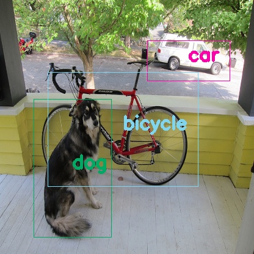
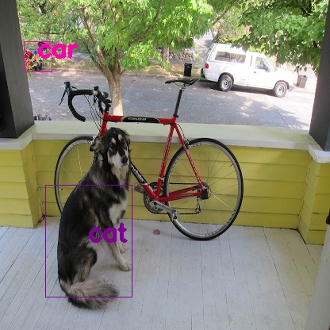

# Inference with tflite_runtime  
- Use tflite_runtime python to infer dog.jpg  
- tflite file `yq.lite` allows inference with experimental quantization  

## Try  
Following [README.md](https://github.com/k5iogura/vinosyp/blob/master/ie/si23tinyyolov2/README.md), make `y.pb` first of all.  
Next,Quantize y.pb to yq.tflite.  
```
 $ make_convert.sh
```

Check floating mode.  
```
 $ python dog_detect_tflite.py 
('input image size:', (576, 768, 3), dtype('float32'), 1.0, 0.0, 0.5017125)
Thresholding on (Objectness score)*(Best class score) with threshold = 0.3
Printing 6 B-boxes survived after score thresholding:
B-Box 1 : [[55, 162, 182, 388], 0.8205543631088047, 'dog']
B-Box 2 : [[241, 66, 376, 132], 0.8049971022428571, 'car']
B-Box 3 : [[243, 54, 369, 125], 0.732440981732735, 'car']
B-Box 4 : [[78, 118, 324, 305], 0.4964802645519055, 'bicycle']
B-Box 5 : [[79, 166, 191, 373], 0.3924193060739505, 'dog']
B-Box 6 : [[271, 63, 383, 135], 0.3099191126765101, 'car']
Non maximal suppression with iou threshold = 0.3
Printing the 3 B-Boxes survived after non maximal suppression:
B-Box 1 : [[55, 162, 182, 388], 0.8205543631088047, 'dog']
B-Box 2 : [[241, 66, 376, 132], 0.8049971022428571, 'car']
B-Box 3 : [[78, 118, 324, 305], 0.4964802645519055, 'bicycle']
```
  

Experimental Quantization mode with uint8.  
```
 $ python dog_detect_tflite.py -t yq.tflite -q
('input image size:', (576, 768, 3), dtype('uint8'), 255, 0, 127.93668523483728)
Thresholding on (Objectness score)*(Best class score) with threshold = 0.005
Printing 18 B-boxes survived after score thresholding:
B-Box 1 : [[57, 233, 166, 374], 0.08050845389762946, 'cat']
B-Box 2 : [[257, 9, 367, 150], 0.026898758014885726, 'car']
B-Box 3 : [[272, 9, 382, 150], 0.026889338738105433, 'car']
B-Box 4 : [[78, -6, 290, 358], 0.02630745590796756, 'motorbike']
B-Box 5 : [[25, 102, 326, 266], 0.023197240308356057, 'motorbike']
B-Box 6 : [[30, 52, 65, 90], 0.02037408463879368, 'car']
B-Box 7 : [[-1, 52, 33, 90], 0.011821758666152808, 'car']
B-Box 8 : [[225, 58, 335, 101], 0.008290038246745646, 'car']
B-Box 9 : [[254, 60, 289, 99], 0.008288428391944179, 'car']
B-Box 10 : [[30, 28, 65, 67], 0.00818133695170253, 'aeroplane']
B-Box 11 : [[57, 256, 166, 397], 0.007980393146497775, 'cat']
B-Box 12 : [[5, 81, 218, 445], 0.007112165412089601, 'chair']
B-Box 13 : [[10, 273, 21, 398], 0.006637312015627209, 'car']
B-Box 14 : [[62, 60, 97, 99], 0.006039879411275072, 'car']
B-Box 15 : [[-121, 31, 409, 367], 0.005864916926250996, 'motorbike']
B-Box 16 : [[394, 49, 405, 174], 0.005738980400455974, 'person']
B-Box 17 : [[254, 380, 289, 419], 0.005547351247723284, 'bottle']
B-Box 18 : [[222, 380, 257, 419], 0.005419917544456628, 'bottle']
Non maximal suppression with iou threshold = 0.005
Printing the 2 B-Boxes survived after non maximal suppression:
B-Box 1 : [[57, 233, 166, 374], 0.08050845389762946, 'cat']
B-Box 2 : [[30, 52, 65, 90], 0.02037408463879368, 'car']
```
  
Cat? Car?  
But atmosphere of animal image is match!  

**Sep.18, 2019**  
